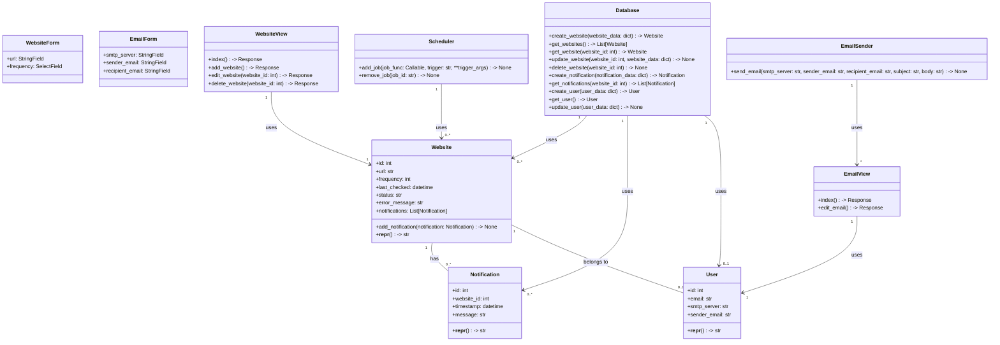
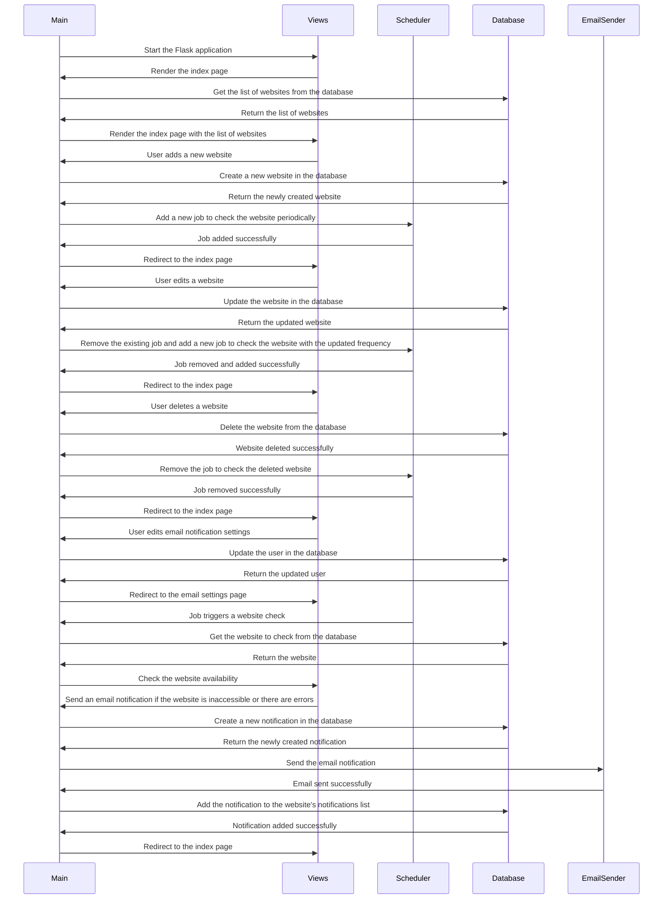

## Implementation approach:
For this project, we can use the following open-source tools and frameworks:
- Flask: A lightweight web framework for creating user interfaces and handling HTTP requests.
- APScheduler: A library for scheduling periodic tasks, which can be used to periodically check the availability of a website.
- Requests: A library for making HTTP requests, which can be used to check the availability of a website.
- SMTP: The built-in SMTP library in Python for sending email notifications.
- SQLAlchemy: An ORM (Object-Relational Mapping) library for working with databases, which can be used to store the history of website checks and notifications.

## Python package name:
```python
"website_monitor"
```

## File list:
```python
[
    "main.py",
    "config.py",
    "models.py",
    "scheduler.py",
    "utils.py",
    "views.py"
]
```

## Data structures and interface definitions:


## Program call flow:


## Anything UNCLEAR:
The requirements are clear to me.